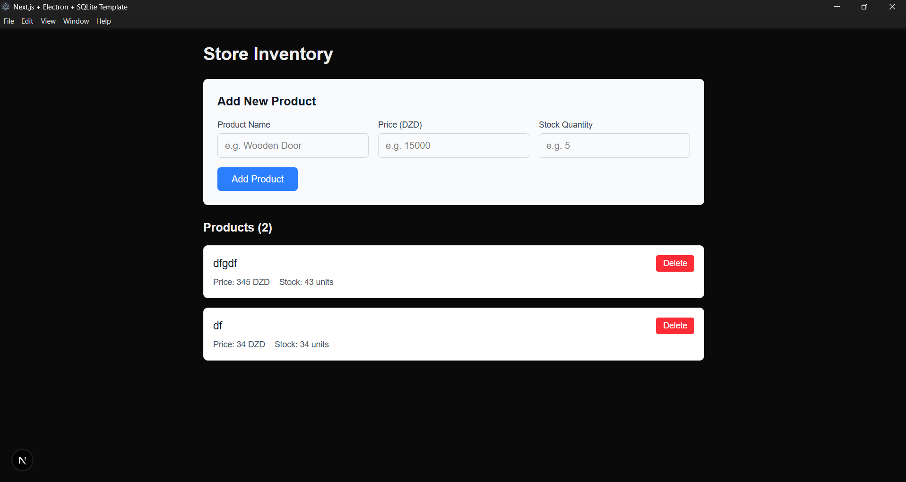

# 🚪 Door Store App

A modern desktop application template built with **Next.js**, **Electron**, and **SQLite**. This project demonstrates how to create a full-stack desktop application with a beautiful UI, local database storage, and cross-platform compatibility.



## 🌟 Features

- ✅ **Modern Frontend**: Next.js 15 with React 19 and TypeScript
- ✅ **Desktop App**: Electron for cross-platform desktop deployment
- ✅ **Local Database**: SQLite with better-sqlite3 for fast, embedded database
- ✅ **Real-time CRUD**: Add, view, and delete products with instant UI updates
- ✅ **Beautiful UI**: Tailwind CSS for responsive and modern design
- ✅ **Type Safety**: Full TypeScript support throughout the application
- ✅ **IPC Communication**: Secure communication between renderer and main process
- ✅ **Development Tools**: Hot reload, debugging, and development server
- ✅ **Build System**: Ready for production packaging with electron-builder

## 🛠️ Tech Stack

### Frontend

- **[Next.js 15](https://nextjs.org/)** - React framework with App Router
- **[React 19](https://react.dev/)** - UI library
- **[TypeScript](https://www.typescriptlang.org/)** - Type safety
- **[Tailwind CSS](https://tailwindcss.com/)** - Utility-first CSS framework

### Desktop

- **[Electron](https://www.electronjs.org/)** - Desktop app framework
- **[electron-builder](https://www.electron.build/)** - Application packaging
- **[electron-rebuild](https://github.com/electron/electron-rebuild)** - Native module rebuilding

### Database

- **[SQLite](https://www.sqlite.org/)** - Embedded database
- **[better-sqlite3](https://github.com/WiseLibs/better-sqlite3)** - Fast SQLite3 bindings

### Development

- **[Concurrently](https://github.com/open-cli-tools/concurrently)** - Run multiple commands
- **[wait-on](https://github.com/jeffbski/wait-on)** - Wait for resources
- **[ESLint](https://eslint.org/)** - Code linting

## 🚀 Quick Start

### Prerequisites

- **Node.js** (v18 or higher)
- **npm** or **yarn**
- **Git**

### Installation

1. **Clone the repository**

   ```bash
   git clone https://github.com/islamdev2022/Next.js-Electron-SQLite-Template
   cd door-store-app
   ```

2. **Install dependencies**

   ```bash
   npm install
   ```

3. **Rebuild native modules for Electron**

   ```bash
   npm run rebuild
   ```

4. **Start development server**
   ```bash
   npm run dev
   ```

This will start both the Next.js development server and the Electron app simultaneously.

## ⚡ Quick Build Guide

**To create a Windows .exe application:**

```bash
# 1. Install dependencies
npm install

# 2. Build the application
npm run dist

# 3. Find your .exe in the dist/ folder
# - DoorStore Setup.exe (installer)
# - DoorStore.exe (portable)
```

**That's it!** Your application is ready for distribution.

## 📁 Project Structure

```
door-store-app/
├── src/
│   └── app/
│       ├── page.tsx          # Main product management page
│       ├── layout.tsx        # App layout
│       └── globals.css       # Global styles
├── electron/
│   ├── main.js              # Electron main process
│   └── preload.js           # Preload script for IPC
├── database/
│   └── db.js                # SQLite database setup
├── types/
│   └── electron.d.ts        # TypeScript definitions
├── package.json             # Dependencies and scripts
├── next.config.ts           # Next.js configuration
├── tsconfig.json           # TypeScript configuration
```

## 📋 Available Scripts

| Command                | Description                                    | Usage                    |
| ---------------------- | ---------------------------------------------- | ------------------------ |
| `npm run dev`          | Start development (Next.js + Electron)         | Development              |
| `npm run dev:next`     | Start only Next.js development server          | Frontend development     |
| `npm run dev:electron` | Start only Electron (requires Next.js running) | Electron testing         |
| `npm run build:next`   | Build Next.js for production                   | Prepare for packaging    |
| `npm run postinstall`  | Rebuild native modules for Electron            | After dependency changes |
| `npm run dist`         | **Build complete .exe application**            | **Create distributable** |

## 🔧 Development Guide

### IPC Communication

The app uses Electron's IPC (Inter-Process Communication) for secure communication between the frontend and backend:

```typescript
// Add product
await window.electronAPI.addProduct({
  name: "product name",
  price: 15000,
  stock: 5,
});

// Get all products
const products = await window.electronAPI.getProducts();

// Delete product
await window.electronAPI.deleteProduct(productId);
```

### Database Schema

The SQLite database contains a `products` table:

```sql
CREATE TABLE products (
  id INTEGER PRIMARY KEY AUTOINCREMENT,
  name TEXT NOT NULL,
  price REAL NOT NULL,
  stock INTEGER DEFAULT 0
);
```

### Adding New Features

1. **Backend (Electron Main Process)**

   - Add IPC handlers in `electron/main.js`
   - Add database operations in `database/db.js`

2. **Preload Script**

   - Expose new functions in `electron/preload.js`

3. **Type Definitions**

   - Update interfaces in `types/electron.d.ts`

4. **Frontend (React)**
   - Use the new functions in your React components

## 🏗️ Building for Production

### Prerequisites for Building

Before building your application, ensure you have:

- **Node.js** (v18 or higher)
- **Python** (for native module compilation)
- **Visual Studio Build Tools** (Windows) or **Xcode** (macOS)

### Step-by-Step Build Process

#### 1. Install Dependencies

```bash
npm install
```

#### 2. Rebuild Native Modules for Electron

```bash
npm run postinstall
```

This rebuilds native modules like `better-sqlite3` to be compatible with Electron.

#### 3. Build Next.js for Production

```bash
npm run build:next
```

This creates an optimized static export in the `out/` directory.

#### 4. Package the Electron App

```bash
npm run dist
```

This creates distributable packages in the `dist/` folder.

### 📦 Build Outputs

After running `npm run dist`, you'll find these files in the `dist/` folder:

#### Windows

- **`DoorStore Setup.exe`** - NSIS installer (recommended for distribution)
- **`DoorStore.exe`** - Portable executable (no installation required)
- **`win-unpacked/`** - Unpacked application folder

#### Available Build Targets

You can customize build targets in `package.json`:

```json
{
  "build": {
    "win": {
      "target": [
        "nsis", // Creates installer
        "portable", // Creates portable .exe
        "zip" // Creates zip archive
      ]
    },
    "mac": {
      "target": [
        "dmg", // macOS disk image
        "zip" // Zip archive
      ]
    },
    "linux": {
      "target": [
        "AppImage", // Portable Linux app
        "deb", // Debian package
        "rpm" // Red Hat package
      ]
    }
  }
}
```

### 🐛 Common Build Issues & Solutions

#### Issue: Native Module Compilation Errors

```bash
Error: The module was compiled against a different Node.js version
```

**Solution:**

```bash
npm run postinstall
# or manually:
npx electron-rebuild
```

#### Issue: Permission Errors (Windows)

```bash
ERROR: Cannot create symbolic link : A required privilege is not held by the client
```

**Solution:** Run PowerShell as Administrator or disable code signing:

```json
{
  "build": {
    "win": {
      "forceCodeSigning": false
    }
  }
}
```

#### Issue: Next.js Font Errors

```bash
assetPrefix must start with a leading slash
```

**Solution:** Remove Google Fonts for Electron builds or use system fonts (already implemented).

#### Issue: CSS/JS Not Loading in Production

**Solution:** Ensure proper `assetPrefix` in `next.config.ts`:

```typescript
const nextConfig: NextConfig = {
  output: "export",
  assetPrefix: "./", // Important for Electron
  images: { unoptimized: true },
};
```

### 🚀 Distribution

#### For Testing

1. Navigate to `dist/win-unpacked/`
2. Run `DoorStore.exe` directly

#### For Distribution

1. Use `DoorStore Setup.exe` - Creates proper Windows installation
2. Upload to your website or app store
3. Users can install like any Windows application

### 📊 Build Size Optimization

To reduce build size:

```bash
# Analyze bundle size
npm run build:next -- --analyze

# Remove development dependencies from final build
npm prune --production
```

### 🔄 Automated Building

For CI/CD pipelines, create a build script:

```json
{
  "scripts": {
    "build:clean": "rimraf dist out .next",
    "build:full": "npm run build:clean && npm run build:next && npm run dist"
  }
}
```

    "mac": {
      "target": ["dmg", "zip"]
    },
    "linux": {
      "target": ["AppImage", "deb"]
    }

```
```


## 🎨 Customization

### Styling

- Modify `src/app/globals.css` for global styles
- Update `tailwind.config.js` for Tailwind customization
- Edit components in `src/app/page.tsx` for UI changes

### Database

- Modify `database/db.js` to add new tables or change schema
- Add corresponding TypeScript interfaces in `types/electron.d.ts`

### Electron Configuration

- Update `electron/main.js` for window settings, menu, etc.
- Modify `electron/preload.js` for new IPC communications

## 🐛 Common Issues & Solutions

### Native Module Issues

If you encounter native module errors:

```bash
npm run rebuild
````

### Port Already in Use

If port 3000 is busy, modify the port in `package.json`:

```json
{
  "scripts": {
    "dev:next": "next dev -p 3001"
  }
}
```

### TypeScript Errors

Ensure all type definitions are up to date in `types/electron.d.ts`.

## 🤝 Contributing

1. Fork the repository
2. Create a feature branch (`git checkout -b feature/amazing-feature`)
3. Commit your changes (`git commit -m 'Add amazing feature'`)
4. Push to the branch (`git push origin feature/amazing-feature`)
5. Open a Pull Request

## 📝 License

This project is licensed under the MIT License - see the [LICENSE](LICENSE) file for details.

## 🙏 Acknowledgments

- [Electron](https://www.electronjs.org/) team for the amazing desktop framework
- [Next.js](https://nextjs.org/) team for the excellent React framework
- [SQLite](https://www.sqlite.org/) for the lightweight database
- [Tailwind CSS](https://tailwindcss.com/) for the beautiful styling system

## 📞 Support

If you have any questions or need help, please:

- Open an issue on GitHub
- Check the [Electron documentation](https://www.electronjs.org/docs)
- Review the [Next.js documentation](https://nextjs.org/docs)

---

⭐ If this template helped you, please give it a star on GitHub!

## 🚀 Deploy Your Own

[](https://vercel.com/new/clone?repository-url=https://github.com/yourusername/door-store-app)

> **Note**: This button is for the Next.js frontend only. For the full Electron app, clone and build locally.
